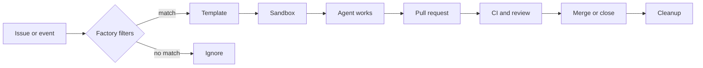

# ElasticClaw

[](LICENSE)
[](https://elasticclaw.ai/docs)

**Open source software factories for coding agents.**

ElasticClaw turns issue tracker events into governed coding pipelines: start the right agent, provision an isolated workspace, inject the issue context, mint scoped GitHub credentials, open the PR, watch review and CI, and clean everything up when the work is done.

Remote coding agents give you a shell. ElasticClaw gives you the factory around it.

<p align="center">
  <a href="https://www.youtube.com/watch?v=2h_-3HsV9Bo">
    
  </a>
</p>

## Why ElasticClaw exists

AI coding agents are getting good enough to do real work, but real work does not begin with a prompt and end with a terminal transcript. It starts in Linear, GitHub Issues, Shortcut, webhooks, releases, customer escalations, dependency alerts, and private operational queues. It needs credentials with boundaries. It needs branch and PR policy. It needs logs, lifecycle state, review handling, CI awareness, and cleanup.

ElasticClaw is the control plane for that loop.

Instead of manually launching agents one at a time, you define **factories**: repeatable workstreams that know when to start, which template to use, what access to grant, which model and tools are allowed, how to drive the PR, and when to tear the workspace down.

## What it does

- **Factories** define a class of work: trigger rules, template, concurrency, issue movement, lifecycle policy, and pipeline.
- **Pipelines** drive the workflow after a claw starts: create, implement, test, open a PR, watch CI, respond to review, merge, fail, and clean up.
- **Scoped GitHub App credentials** give each claw temporary repo access instead of broad personal tokens.
- **Templates** describe the runtime for a job: repos, bootstrap files, instructions, secrets, MCP servers, model defaults, and provider settings.
- **Issue tracker integrations** turn Linear, GitHub Issues, Shortcut, and webhook events into structured work.
- **Sandbox providers** run each claw in an isolated workspace using Daytona, Replicated CMX, or exe.dev.
- **Single-binary hub** gives you the API, web UI, state, settings, and integrations in one self-hosted Go service.

Each running agent is a **claw**. A claw runs [OpenClaw](https://github.com/openclaw/openclaw), connects back to the hub through `claw-bridge`, clones the allowed repos, receives the issue context, and works inside an ephemeral VM.

## The factory loop



ElasticClaw is designed for the jobs that should happen again and again:

- Bug lanes from Linear statuses
- Dependency update factories
- Docs and migration queues
- Release follow-up tasks
- Customer escalation workflows
- Background "dark factory" work that should produce PRs, not meetings

## Quick start

Install the CLI:

```bash
brew tap elasticclaw/elasticclaw
brew install elasticclaw
```

Deploy a hub to an Ubuntu VPS:

```bash
elasticclaw install \
  --server ssh://root@my-server.com \
  --domain hub.mycompany.com \
  --ssh-key ~/.ssh/id_ed25519
```

Then configure the pieces your first factory needs:

1. A sandbox provider such as Daytona, Replicated CMX, or exe.dev.
2. A GitHub App so ElasticClaw can mint scoped installation tokens.
3. A template that defines repos, instructions, secrets, tools, and model defaults.
4. An issue source such as Linear, GitHub Issues, Shortcut, or a webhook.
5. A factory that ties the trigger, template, access, and lifecycle together.

Watch the installation walkthrough: [YouTube quick start](https://www.youtube.com/watch?v=1joBaUrtwOA).

Full setup guide: [elasticclaw.ai/docs/installation](https://elasticclaw.ai/docs/installation)

## Three ways to start work

**From an issue tracker**

Move a ticket to a trigger status, apply a label, assign it, or let your normal workflow send the event. The factory filters the event and starts a claw with the issue body, links, labels, repos, and instructions.

**From the web UI**

Create and inspect claws, manage templates, configure providers, review logs, and connect integrations from the embedded dashboard.

**From your own automation**

Use webhooks and the hub API to connect private queues, release events, internal systems, or scheduled jobs.

## Architecture

ElasticClaw has four main moving parts:

- **Hub**: the self-hosted control point for settings, integrations, secrets, factories, templates, lifecycle state, and the web UI.
- **Provider**: the execution backend that creates isolated workspaces.
- **Bridge**: the connector running inside the workspace that links OpenClaw to the hub.
- **Claw**: the agent workspace doing the actual coding work.

The hub owns policy. Providers own compute. OpenClaw owns the coding session. ElasticClaw connects them into a repeatable issue-to-PR pipeline.

## Documentation

- [Overview](https://elasticclaw.ai/docs)
- [Installation](https://elasticclaw.ai/docs/installation)
- [Factories](https://elasticclaw.ai/docs/factories)
- [Templates](https://elasticclaw.ai/docs/templates)
- [Providers](https://elasticclaw.ai/docs/providers)
- [GitHub integration](https://elasticclaw.ai/docs/github-integration)
- [Linear integration](https://elasticclaw.ai/docs/linear-integration)
- [CLI reference](https://elasticclaw.ai/docs/cli-reference)

## Project status

ElasticClaw is early, open source, and moving quickly. The core loop is usable today: deploy a hub, connect a provider, configure GitHub and an issue tracker, and run agents from real work queues.

The vision is broader: software factories that are owned by teams, wired into existing systems, and governed by explicit pipelines instead of ad hoc prompts.

## Contributing

See [CONTRIBUTING.md](CONTRIBUTING.md) for development setup and workflow.

If ElasticClaw looks useful, stars and public feedback help other developers find the project. Try it, break it, post what was confusing, and show what you built.

## License

[Apache 2.0](LICENSE)
